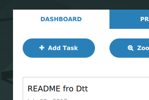
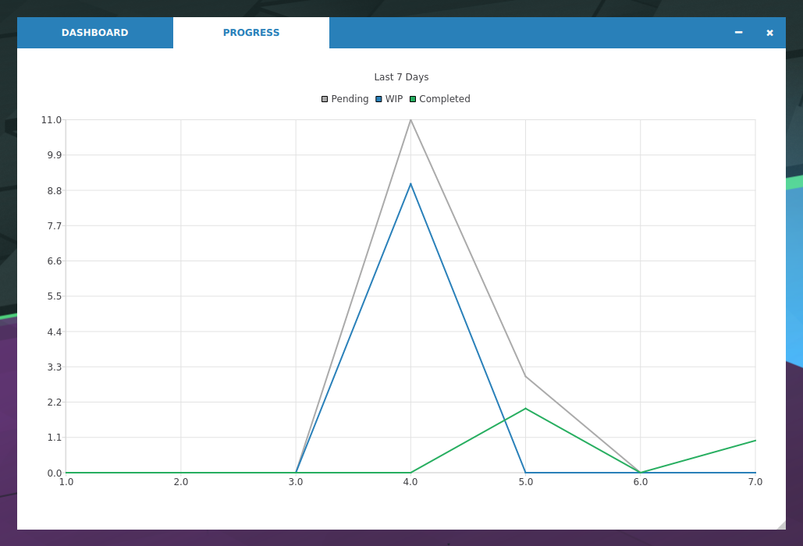

# Daily Task Tracker
add your tasks with their importance and dtt will show your progress of last 7 days on a graph

### Using
dtt is very easy to use application

Tasks on Left means Pending tasks, on the middle are Work In Progress tasks and on the right are completed tasks.

* click Add Task Btn on DASHBOARD to create a task

* fill details of your Task

* click menu btn on a task for stepping or deleting a task

* click PROGRESS Tab for showing the progress

Axis
* X : 7 days , left most being the oldest and right most denotes today
* Y : total score (Pending/working for/Completed)

Lines
* Pending line shows total score of tasks pending from a particular day
* WIP line shows total score of WIP tasks from a particular day
* Completed shows total score of tasks completed on a particular day
