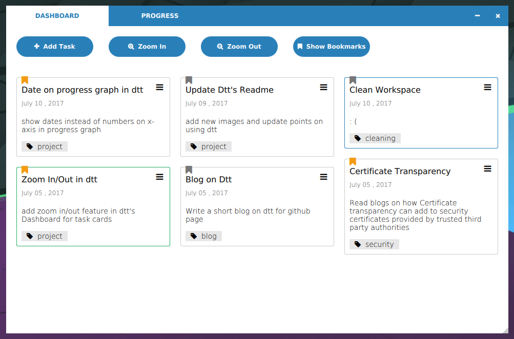
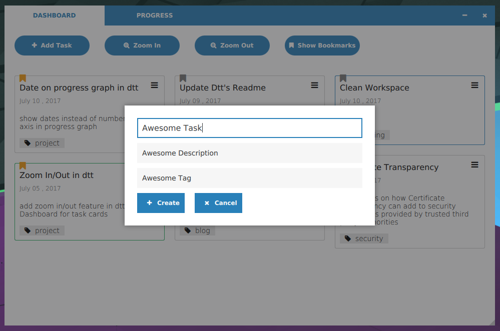
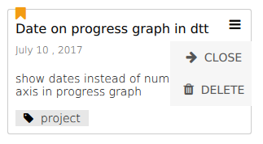
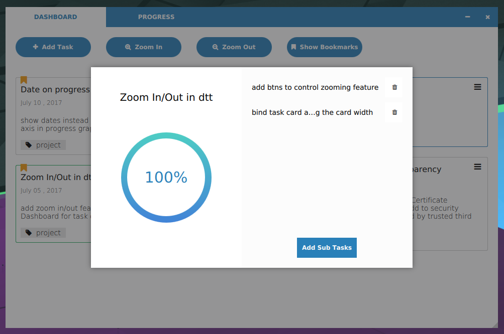
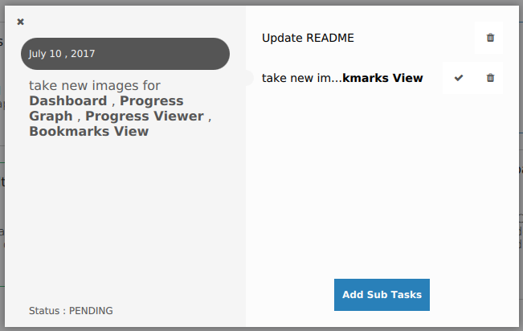
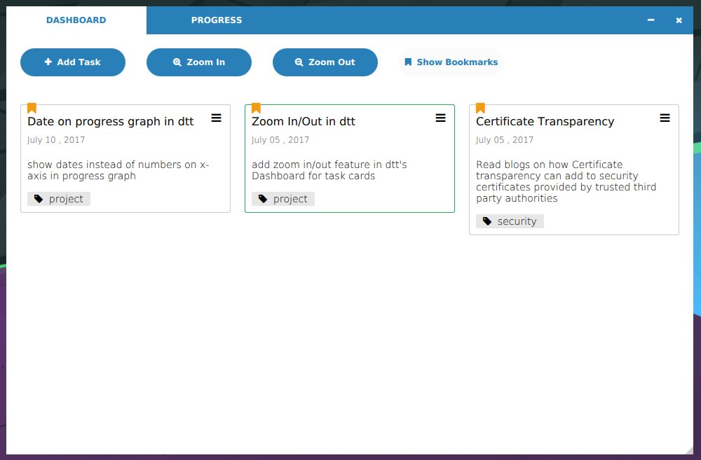
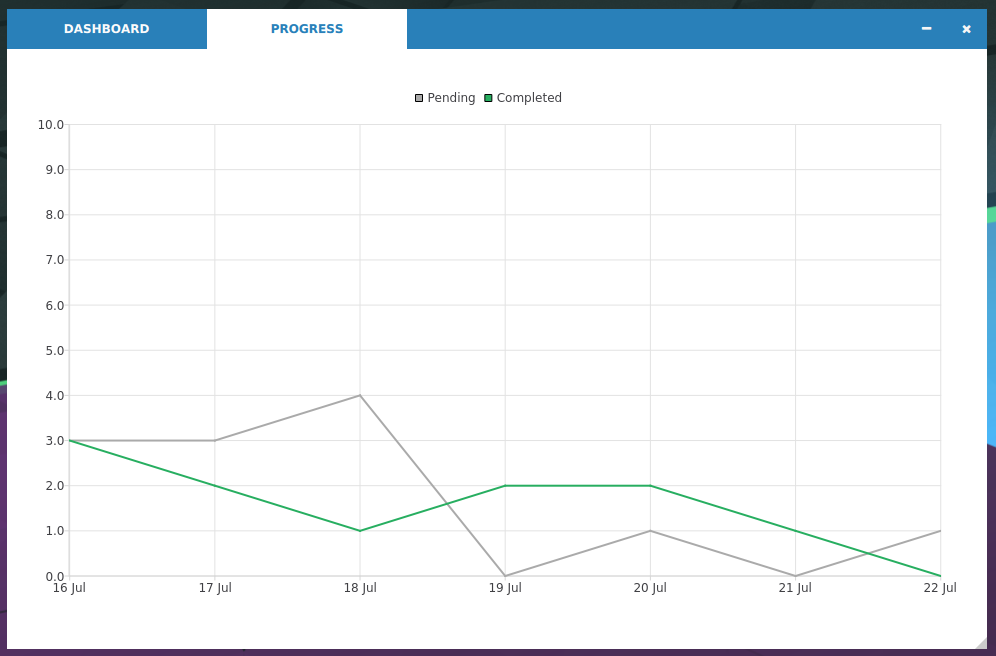

# Using

* [Dashboard](#dashboard)
* [Creating a Task](#creating-a-task)
* [Closing or Deleting a Task](#closing-or-deleting-task)
* [Create/Show SubTasks](#show-subtasks)
* [Bookmarks](#bookmarks)
* [Progress Graph](#progress-graph)

## DASHBOARD

 : Pending Task (i.e. some subtasks are pending)

 : Task with 100% Progress (i.e all subtasks completed)

 : Task is closed

## CREATING A TASK

* click Add Task Btn on DASHBOARD to create a task
* fill details of your Task

## CLOSING OR DELETING TASK

* click menu btn on a task to close/reopen or delete

## SHOW SUBTASKS

* click on a Task to show details like subtasks, progress (% of task done)

* click on subtask to show full details in left pane

 

> qml's Text object displays rich text so you can format your subtask using b, i, u, li, a, etc

## BOOKMARKS

* a task can be bookmarked by clicking on bookmark btn on top of a task card
* click on Bookmarks btn on Dashboard to show bookmarked tasks only

## PROGRESS GRAPH

* click PROGRESS Tab for showing the progress

Axis
* X : days
* Y : no of subtasks

Lines
* Pending line shows total subtasks created on a day
* Completed shows total total subtasks completed on a day

> if a task does not have any subtasks in it, then that task will be considered as one subtask for calculating progress graph
